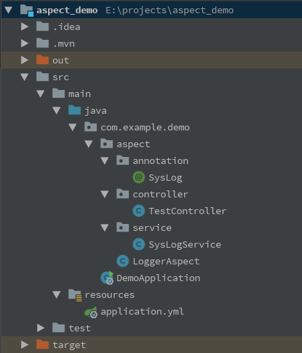
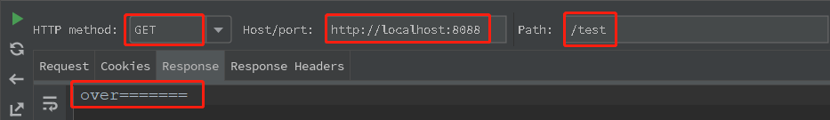
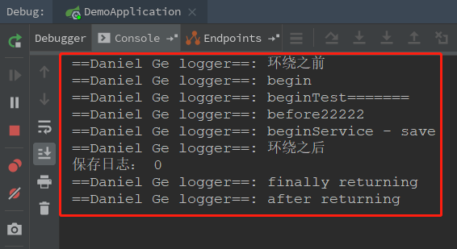

面向切面编程的目的很明确，那就是**把通用的业务逻辑同其他业务分离开来**。比如**权限认证、日志、事务处理**等等。下面将简单介绍一下相关概念，如果不愿看概念，可直接跳过此部分，看后面的代码小栗子，代码看不懂的时候再回头来看概念。

### 1.切面（Aspect）

首先要理解「切」字。用传统的面向对象编程思维，我们可以把对象想象成一个立方体。每次实例化一个对象，对类定义中的成员变量赋值，就相当于对这个立方体进行了一个定义，定义完成之后，那个对象就在那里等着被使用和回收。

而面向切面编程则是指，对于一个我们已经封装好的类，我们可以在编译期间或在运行期间，对其进行切割，把立方体切开，在原有的方法里面添加（织入）一些新的代码，对原有的方法代码进行一次增强处理。而那些增强部分的代码，就被称之为切面。

### 2.切入点（PointCut）

 要对哪些类中的哪些方法进行增强，进行切割，指的是被增强的方法。

### 3.连接点（JoinPoint）

我们知道了要切哪些方法后，剩下的就是什么时候切，在原方法的哪一个执行阶段加入增加代码，这个就是连接点。如方法调用前，方法调用后，发生异常时等等。 

### 4.通知（Advice）

通知即为切面的具体实现，即告诉被织入的方法该如何被增强。比如方法 begin() 被 @Before 注解了，那么 begin() 的方法体就是通知。

### 5.目标对象（Target  Object）

被一个或多个切面所通知的对象，即为目标对象。

### 6.AOP 代理对象（AOP Proxy Object）

AOP 代理是 AOP 框架所生成的对象，该对象是目标对象的代理对象。代理对象能够在目标对象的基础上，在相应的连接点上调用通知。

### 7.织入（Weaving）

将切面切入到目标方法之中，使目标方法得到增强的过程被称之为织入。

### 8.SpringBoot 应用 AOP 的入门小栗子

首先来看一眼项目的结构：

基本还是按照 MVC 设计模式来分包的：

- SysLog：自定义的一个注解，在此例中会被当做成一个切入点，使用了这个注解的地方都会调用与之对应的切面方法；
- LoggerAspect：日志切面类，切面类的详细定义还需去看源码；
- SysLogService：日志 Service 层，其中定义的方法为本例另一个切入点；
- TestController：日志 Controller 层，测试类；

用 rest client 发请求测试接口：

控制台打印结果：

