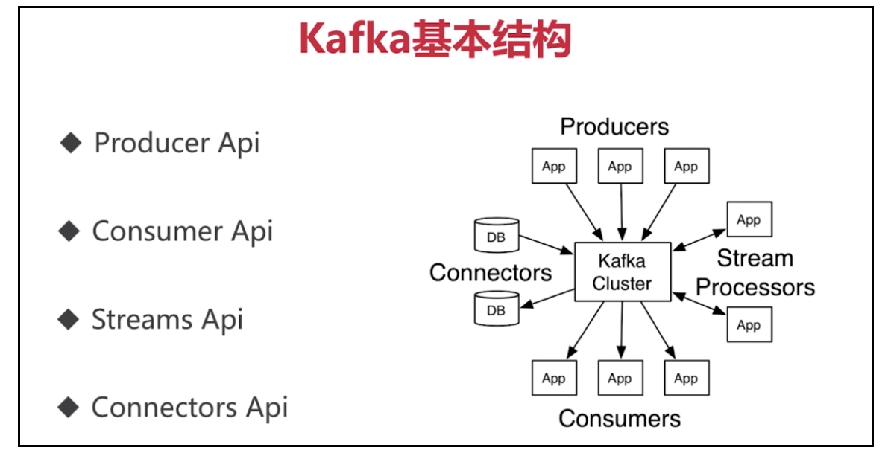

1.搭建环境

在运行 Kafka 程序之前，第一步依然是搭建运行环境，首先当然是确保 jdk 已安装。

#### 1.1 安装 Zookeeper

其次，Kafka 的运行依赖于 Zookeeper，所以在运行 Kafka 之前我们需要安装并运行 Zookeeper。首先在 [Zookeeper 官网](http://zookeeper.apache.org/releases.html#download)下载安装包，选择包名为 apache-zookeeper-3.5.6-bin.tar.gz 的这个。温馨提示：在[清华镜像]( https://mirrors.tuna.tsinghua.edu.cn/apache/zookeeper/stable/ )上下载的速度更快。

然后依次按照下列步骤进行：

- 解压下载好的安装包（本文解压到 D:\java\zookeeper）

- 打开 D:\java\zookeeper\apache-zookeeper-3.5.6-bin\conf，把 zoo_sample.cfg 重命名成 zoo.cfg

- 用文本编辑器打开 zoo.cfg，把 dataDir 的值改成“E:\\softwareData\\zookeeper\\data”(任意) 

- 在环境变量中添加如下系统变量：

  ```shell
  ZOOKEEPER_HOME: D:\java\zookeeper\apache-zookeeper-3.5.6-bin
  Path: 在现有的值后面添加 "%ZOOKEEPER_HOME%\bin"
  ```


-  运行 Zookeeper: 

   打开cmd，进入bin目录:

  ```shell
  cd  D:\java\zookeeper\apache-zookeeper-3.5.6-bin
  ```

  启动 Zookeeper：

  ```shell
  zkServer.cmd  
  ```

   新开一个cmd，若能够查到端口，就说明已经启动：

  ```shell
  netstat -ano|findstr "2181"
  ```


#### 1.2 安装 Kafka

在 [Kafka 官网](http://kafka.apache.org/downloads.html)下载安装包，选择 kafka_2.12-2.3.0.tgz 这个包。下载完成以后，按照下列步骤进行：

- 解压文件（比如解压到 D:\java\kafka）

- 打开 D:\java\kafka\kafka_2.12-2.3.0\config，用文本编辑器打开 server.properties 

- 把 log.dirs 的值改成 “D:\\java\\kafka\\kafka_2.12-2.3.0\\kafka-logs”

- 打开 cmd，进入 kafka 的 Home 目录: cd D:\java\kafka\kafka_2.12-2.3.0

- 启动 kafka：

  ```shell
  .\bin\windows\kafka-server-start.bat .\config\server.properties
  ```

### 2.创建 Topic

重新打开一个 cmd 然后进入：

```shell
cd D:\java\kafka\kafka_2.12-2.3.0\bin\windows
```

创建一个 Topic：

```shell
kafka-topics.bat --create --zookeeper localhost:2181 --replication-factor 1 --partitions 1 --topic DanielGe
```

### 3.打开一个 Producer

重新打开一个 cmd 然后进入：

```shell
cd D:\java\kafka\kafka_2.12-2.3.0\bin\windows
```

打开一个 Producer：

```shell
kafka-console-producer.bat --broker-list localhost:9092 --topic DanielGe
```

### 4.打开一个 Consumer

重新打开一个 cmd 然后进入：

```shell
cd D:\java\kafka\kafka_2.12-2.3.0\bin\windows
```

打开一个 Consumer：

```shell
kafka-console-consumer.bat --bootstrap-server localhost:9092 --topic DanielGe
```

然后就可以在 Producer 控制台窗口输入消息了。在消息输入过后，Consume 窗口很快会接收到 Producer 发来的消息：


至此，Kafka 运行环境的搭建及用命令演示的小栗子就完成啦！

### 5.Spring Boot 应用 Kafka 的小栗子

整个小栗子的工程源码在 **sourceProject** 文件夹中，可直接导入 IDEA 运行。

#### 5.1 Quick Start

导入项目 demokfa，确保本机的 zookeeper 和 kafka 都已经启动后，再启动项目 demokfa。然后打开 IDEA 自带的 WebService 接口测试工具（Tools -> HTTP Client -> Test RESTful Web Service）。

发送一个 GET 请求：


收到响应：


发送一个 POST 请求：


收到响应：


POST 请求发送成功后，控制台也会打印出收到的消息：


测试成功。

#### 5.2 核心类讲解

生产者向消费者发送的消息实体类：

```java
import lombok.EqualsAndHashCode;
import lombok.Getter;
import lombok.Setter;

@Getter
@Setter
@EqualsAndHashCode
public class MessageEntity {
    private String title;
    private String body;

    @Override
    public String toString() {
        return "MessageEntity{" +
                "title='" + title + '\'' +
                ", body='" + body + '\'' +
                '}';
    }
}
```

生产者类：

```java
@Component
public class SimpleProducer {

    @Autowired
    @Qualifier("kafkaTemplate")
    private KafkaTemplate<String, MessageEntity> kafkaTemplate;

    public void send(String topic, MessageEntity message) {
        kafkaTemplate.send(topic, message);
    }

    public void send(String topic, String key, MessageEntity entity) {
        ProducerRecord<String, MessageEntity> record = new ProducerRecord<>(
                topic,
                key,
                entity);

        long startTime = System.currentTimeMillis();

        ListenableFuture<SendResult<String, MessageEntity>> future = kafkaTemplate.send(record);
        future.addCallback(new ProducerCallback(startTime, key, entity));
    }

}
```

消费者类：

```java
@Slf4j
@Component
public class SimpleConsumer {

    private final Gson gson = new Gson();

    @KafkaListener(topics = "${kafka.topic.default}", containerFactory = "kafkaListenerContainerFactory")
    public void receive(MessageEntity message) {
        log.info(gson.toJson(message));
    }
}
```

控制类（发送消息的接口）：

```java
@Slf4j
@RestController
@RequestMapping("/kafka")
public class ProduceController {
    @Autowired
    private SimpleProducer simpleProducer;

    @Value("${kafka.topic.default}")
    private String topic;

    private Gson gson = new Gson();

    @RequestMapping(value = "/hello", method = RequestMethod.GET, produces = {"application/json"})
    public Response sendKafka() {
        return new Response(ErrorCode.SUCCESS, "OK");
    }


    @RequestMapping(value = "/send", method = RequestMethod.POST, produces = {"application/json"})
    public Response sendKafka(@RequestBody MessageEntity message) {
        try {
            log.info("kafka的消息={}", gson.toJson(message));
            simpleProducer.send(topic, "key", message);
            log.info("发送kafka成功.");
            return new Response(ErrorCode.SUCCESS, "发送kafka成功");
        } catch (Exception e) {
            log.error("发送kafka失败", e);
            return new Response(ErrorCode.EXCEPTION, "发送kafka失败");
        }
    }

}
```

另外注意一下 application.properties 中的部分配置：


### 6.Kafka 知识概念学习

这一部分讲解 Kafka 的基础知识和相关原理，比较枯燥，纯粹为了以后的复习记录在这里，不想看的朋友可直接略过。

Kafka 是目前主流的**流处理**平台，在大数据开发中，它作为黏合剂串联起各个系统。与此同时，Kafka 也是消息队列家族中的一员，因其高吞吐性而成为很多场景下的主流选择。

**流数据**：流数据是一组顺序、大量、快速、连续到达的数据序列,一般情况下,数据流可被视为一个随时间延续而无限增长的动态数据集合。应用于网络监控、传感器网络、航空航天、气象测控和金融服务等领域。

#### 6.1 Kafka 是什么

Kafka 有三个特性：

- 可以发布和订阅数据的流，类似于**消息队列**
- **存储数据的流**（以一种可容忍错误的方式）
- 当数据产生时**处理数据的流**

Kafka 常应用于两类应用：

- 当系统或应用之间有很强的数据依赖关系的时候，**构建实时数据流管道**
- **构建实时的处理数据流的应用**，它可以转换或者响应数据流

因此可以说，Kafka 是一个消息队列，但它不仅仅是一个消息队列。下图是数据的生命周期，可以看出日志是始终伴随着数据的，从中也能看到熟悉的**生产和消费的消息模式**和**数据与日志的存储模式**，这也是 Kafka 重点关注的内容。


#### 6.2 Kafka 的基本概念

1）Producer：消息和数据的生产者，向 Kafka 的一个 topic 发布消息的进程、代码、服务。<br/>2）Consumer：消息和数据的消费者，订阅数据（topic）并且处理其发布的消息的进程、代码、服务。<br/>3）Consumer Group（逻辑概念）：对于同一个 topic，会广播给不同的 group，一个 group 中，只有一个 consumer 可以消费该消息。<br/>4）Broker（物理概念）：Kafka 集群中的每个 Kafka 节点（指物理服务器）。<br/>5）Topic（逻辑概念）：Kafka 消息的类别，对数据进行区分、隔离。<br/>6）Partition（物理概念）：Kafka 下数据存储的基本单元。一个 Topic 数据，会被分散存储到多个 Partition，每一个 Partition 是有序的。一个 Partition 只能存在于一个 Broker 上。

- 每一个 topic 被切分为多个 Partitions
- 消费者数目少于或等于 Partition 的数目
- Broker Group 中的每一个 Broker 保存 Topic 的一个或多个 Partitions
- Consumer Group 中的仅有一个 Consumer 读取 Topic 的一个或多个 Partitions，并且是唯一的 Consumer

 7）Replication（副本）：同一个 Partition 可能会有多个 Replica，多个 Replica 之间的数据是一样的。

- 当集群中有 Broker 挂掉的情况，系统可以主动地使 Replicas 提供服务
- 系统默认设置每一个 Topic 的 replication 系数为 1，可以在创建 Topic 时单独设置
- Replication 的基本单位是 Topic 的 Partition
- 所有的读写都从 Leader 进，Followers 只是作为备份
- Follower 必须能够及时复制 Leader 的数据
- 增加容错性与可扩展性

 8）Replication Leader：一个 Partition 的多个 Replica 上，需要一个 Leader 负责该 Partition 上与 Producer 和 Consumer 的交互。（原因是副本很多，有一个 Leader 才知道应该用谁的）<br/>9）ReplicaManager：负责管理当前 Broker 所有分区和副本的信息，处理 KafkaController 发起的一些请求，副本状态的切换、添加、读取消息等。

#### 6.3 Kafka 的基本结构



- 数据从上往下流
- Connectors 与 DB 进行交互
- Processors 与其他的 APP 进行交互
- 生产者-消费者是最常用的模式


Kafka 强依赖 ZooKeeper，ZooKeeper 存储了 Kafka 的这些信息：

- Broker 的信息
- Topic 和 Partition 的信息

Producer 生产的数据推送到 Kafka 后，相关的变更会记录在 Kafka 的 Broker 的磁盘空间上，也就是记录在对应的 Partition 上，Consumer 通过订阅 Kafka 的消息来获得数据的变更。在结构图的下方我们可以看到 Consumer 的应用场景主要有以下几个：

- Hadoop 集群
- 实时监控
- 数据仓库
- 其他服务


- OfferSet：记录当前消息的偏移量
- Length：记录的是整条消息的长度
- CRC32：校验字段，校验信息的完整性
- Magic：特定数字，判断数据是否属于Kafka，不属于就直接丢弃
- Attributes：（可选）记录的是数据的多个属性，会有一个枚举值

#### 6.4 Kafka 的特点

从分布式角度：

- 多分区（Partition）
- 多副本
- 多订阅者
- 基于 ZooKeeper 调度

从高性能角度：

- 高吞吐量（每秒几十万）
- 低延迟
- 高并发（与高吞吐量并存）
- 时间复杂度为 O（1）（与低延迟并存）

 从持久性与扩展性角度：

- 数据可持久化

- 容错性

- 消息自动平衡

  避免消息过于集中在某几台服务器上，导致数据频繁地访问这几台机器，从而出现热点问题。

- 支持在线水平扩展

  e.g.一个 Broker/Topic 可以有多个 Partition；Consumer Group 组内的变动对整体的影响很小；增加新的机器就可以增加新的 Topic/Partition。

#### 6.5 Kafka 的应用场景

1）消息队列<br/>2）行为跟踪：比如跟踪用户的浏览记录<br/>3）元信息监控：记录操作信息，运维性质<br/>4）日志收集<br/>5）流处理：保存、收集上游的流数据，对接到下游去做计算和存储<br/>6）事件源：将状态按时间顺序排列成一个记录，可以回溯整个事件的变更<br/>7）持久性日志

#### 6.6 Kafka 的简单案例

本文开始的案例是在 Windows 下运行的，此案例则演示在 Linux 下，安装包与环境变量的配置自行解决。

启动 ZooKeeper：


启动 Kafka：


创建 Topic：


发布消息：


#### 6.7 Kafka 的高级特性

**1）消息事务**

为什么要支持事务？

- 为了满足“读取-处理-写入”这种模式
- 流数据处理这方面需求的不断增强
- 对于数据处理不准确的容忍度在降低

数据传输的事务定义：

- 最多一次：最多被传输一次，有可能一次也不传输，消息不会被重复发送。
- 最少一次：（目前用的最多的）最少被传输一次，消息不会被漏掉，但有可能被重复传输。
- 精确的一次：不漏传也不会重传，每个消息都被传输一次且仅被传输一次，这是最理想的状态。

如何保证事务呢？

- 内部重试：procedure 幂等处理（Kafka 内部已实现）
- 多分区原子写入
- 避免僵尸实例

**2）零拷贝**

- 存在的问题：

  网络传输持久性日志块（其实就是生产-消费模式里传输的消息），传输消息这个操作其实很消耗性能，Kafka 因此采用零拷贝技术来解决这块的性能问题。

- 解决方法：

  用 Java NIO 的 channel.transforTo() 方法即可。

- 底层原理：

  使用了 Linux sendfile 的系统调用。

- 了解一下原始的将文件数据传输到网络上的过程：

  【1】操作系统将数据从磁盘读入到内核空间的页缓存；

  【2】应用程序将数据从内核空间读入到用户空间的缓存中（因为应用程序只能读用户空间）；

  【3】应用程序将数据写回到内核空间的 socket 缓存中；

  【4】操作系统将数据从 socket 缓冲区复制到网卡缓冲区，以便将数据经网络发出。

  一共需要 4 次拷贝过程。

- 零拷贝过程：

  【1】操作系统将数据从磁盘读入到内核空间的页缓存；

  【2】将数据的位置和长度的信息的描述符增加至内核空间（socket缓冲区）；

  【3】操作系统将数据从内核拷贝到网卡缓冲区，以便将数据经网络发出。

  一共需要两次拷贝过程（**零拷贝：内核空间和用户空间之间的交互拷贝次数为零**）。

- 拷贝路径演变图：

  