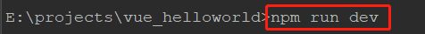
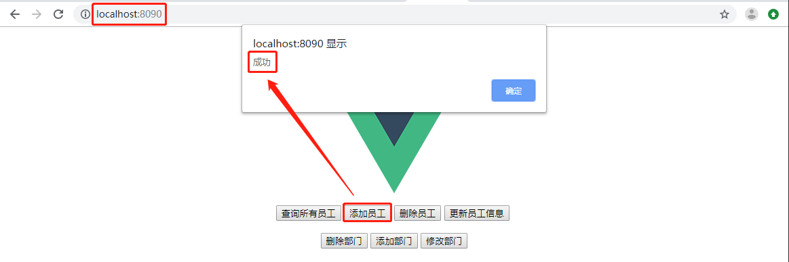

### Quick Start

**1**.这个小栗子的功能是增删改查员工、部门，多对一。

**2**.前后端两个项目的源码在 sourceCode 文件夹中，本地需要安装 MySQL 数据库，并新建一个名为 demo 的数据库，注意后端项目配置的连接数据库的用户名和密码为 root/123456，如若不同，则需要根据实际情况自行修改，修改位置位于 demo 项目的 application.yml 文件中。

**3**.将后端项目 demo 导入 IDEA（导入后有可能需要先解决一些环境问题），然后进入 terminal 面板，接着进入项目的根目录 demo，进入子目录 target，执行下面的命令运行项目：


demo 的端口为 8080。

**4**.将前端项目 vue_helloworld 导入 IDEA，同样地进入 terminal 面板，进入项目根目录 vue_helloworld，执行下面的命令运行项目：



vue_helloworld 的端口为 8090。

**5**.在浏览器中访问 vue_helloworld 项目首页，点击【添加员工】，若弹出提示【成功】，则可以在数据库中查询到刚刚添加成功的员工信息。



如果前端项目启动失败，请接着往下看。

### vue_helloworld 项目创建过程

要想运行 vue 项目，则需要一个能够运行 vue 项目的环境，所以首先我们就得检查 vue 的环境是否已装好，相关的命令：

```shell
node -v # 查看 node 版本
npm -V # 查看 npm 版本
cnpm -v # 查看 cnpm 版本
vue -V # 查看 vue 版本
yarn -V # 查看 yarn 版本
vue -help # vue help 命令
```

如果没装，从安装 node.js 开始，具体的安装步骤可参考下面这篇文章（非常详细，耐心的一步一步照做即可）：

[npm安装教程（vue.js）]( https://www.cnblogs.com/linkenpark/p/9371245.html )

我按照这篇文章操作了以后，发现有几个地方需要注意一下：

- 在安装 npm 的时候，设置的淘宝镜像应该是 https 的而不是 http 。

  ```shell
  npm config set registry https://registry.npm.taobao.org # 设置镜像
  npm config get registry # 检查设置是否生效
  ```

- 如果执行 npm run dev 命令时一直失败，那么可以尝试用一下命令 **cnpm run dev** 来启动。

  ```shell
  npm install -g cnpm --registry=https://registry.npm.taobao.org # 安装cnpm
  cnpm -v # 检测安装是否成功
  cnpm run dev # 启动
  ```

顺带提一下，环境安装好以后，如果我们要跑的是别人的项目，那么此时就需要导入 vue 项目，可参考下面这篇文章（只看这篇文章的后半部分即可）：

[idea中导入别人的vue项目并运行]( https://www.cnblogs.com/guoguo327/p/11236004.html )

接下来再来说说项目 vue_helloworld，其实，整个前后端分离的两个小项目都是我参照下面这篇文章做出来的：

[Vue+SpringBoot 前后端分离小实验]( https://www.cnblogs.com/zzsuje/articles/10449921.html )

但是这篇文章写得不够详细，到前端部分的时候没有讲解如何用 vue 脚手架创建项目，所以我又再次地学习了一下下面这篇文章，搭建了一个最简单的 vue hello world 项目：

[用 IntelliJ IDEA 从零搭建一个最简单的 Vue 项目]( https://blog.csdn.net/iw1210/article/details/90044778 )

除此之外，仍然还有一些不够详细的地方需要再次说明一下：

- 在使用 axios 前需要安装 axios 插件。

  ```shell
  # 1.安装插件
  npm install axios 
  ```

  ```shell
  # 2.然后在 src/main.js 中将其添加到原型链上方可在任何组件中使用 axios
  import axios from 'axios'
  Vue.prototype.$axios = axios
  ```

- 修改此文件可设置 vue 项目的启动端口：config/index.js。

- HelloWorld.vue 页面中按钮的监听函数写在 script 标签的 methods 中，在修改函数和删除函数发送的请求中，url 最后的数字对应的是数据库表记录的 id。

- 在 src/router/index.js 中添加 **mode: 'history'** 可以去掉访问 vue 页面时，页面的 URL 里最后的 # 号。

  ```javascript
  import Vue from 'vue'
  import Router from 'vue-router'
  import HelloWorld from '@/components/HelloWorld'
  
  Vue.use(Router)
  
  export default new Router({
    mode: 'history',
    routes: [
      {
        path: '/',
        name: 'HelloWorld',
        component: HelloWorld
      }
    ]
  })
  ```

- 不知道为啥，vue_helloworld 用 8081 端口不行，改成 8090 端口就可以了。

### demo 项目的 application.yml 文件

```yaml
spring:
  datasource:
    driver-class-name: com.mysql.jdbc.Driver
    url: jdbc:mysql://127.0.0.1:3306/demo
    username: root
    password: 123456
  jpa:
    hibernate:
      ddl-auto: update
    show-sql: true
server:
  port: 8080
```

